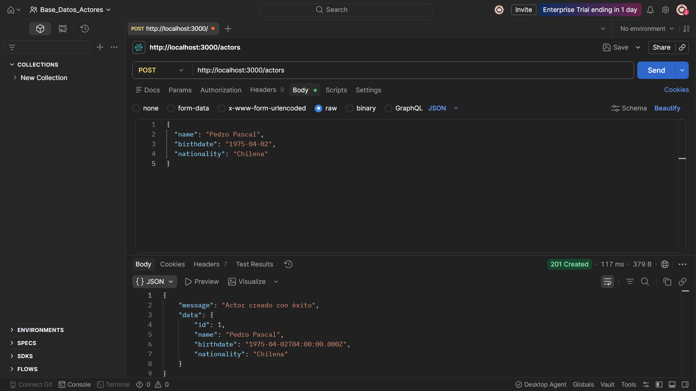
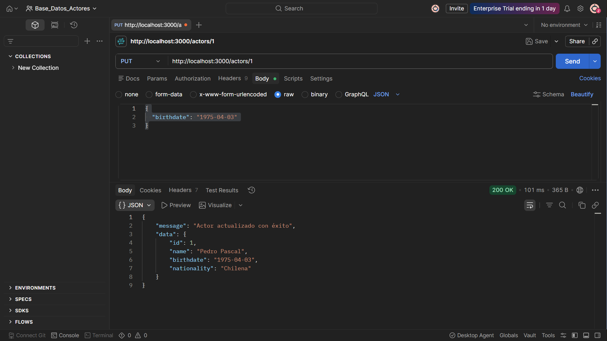
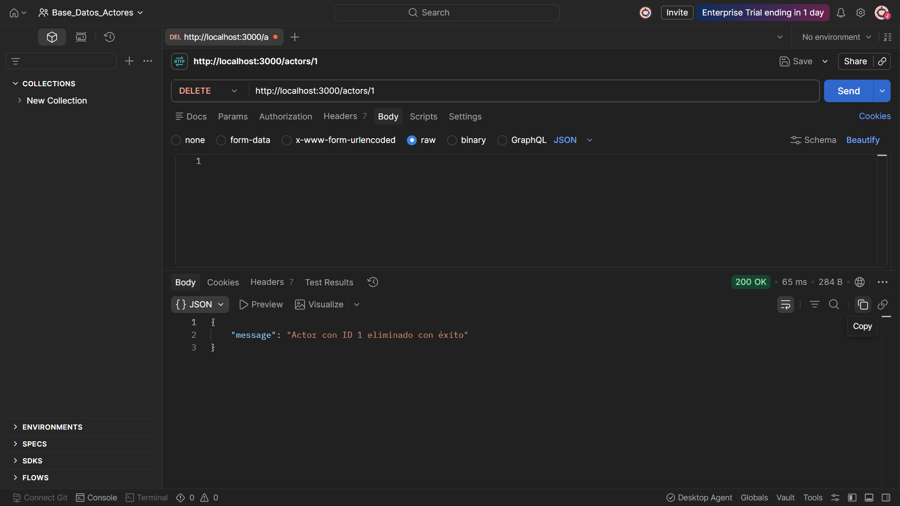
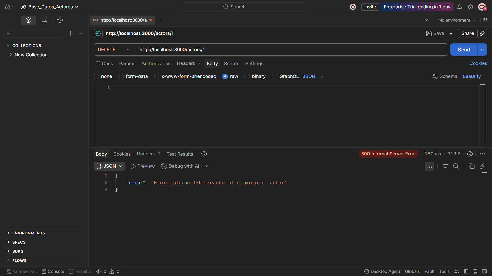

### Manipulación de Datos con Node.js y PostgreSQL en Postman

En este proyecto, se ha desarrollado una aplicación backend utilizando Node.js y Express para gestionar una base de datos PostgreSQL que almacena información sobre actores. La aplicación permite realizar operaciones CRUD (Crear, Leer, Actualizar, Eliminar) a través de endpoints RESTful.

### POST Ingreso de actor con id, nombre, fecha de nacimiento y nacionalidad

### PUT Actualización de fecha de nacimiento de un actor por su id

### DELETE Eliminación de un actor por su id

### Manejo de errores con try/catch

